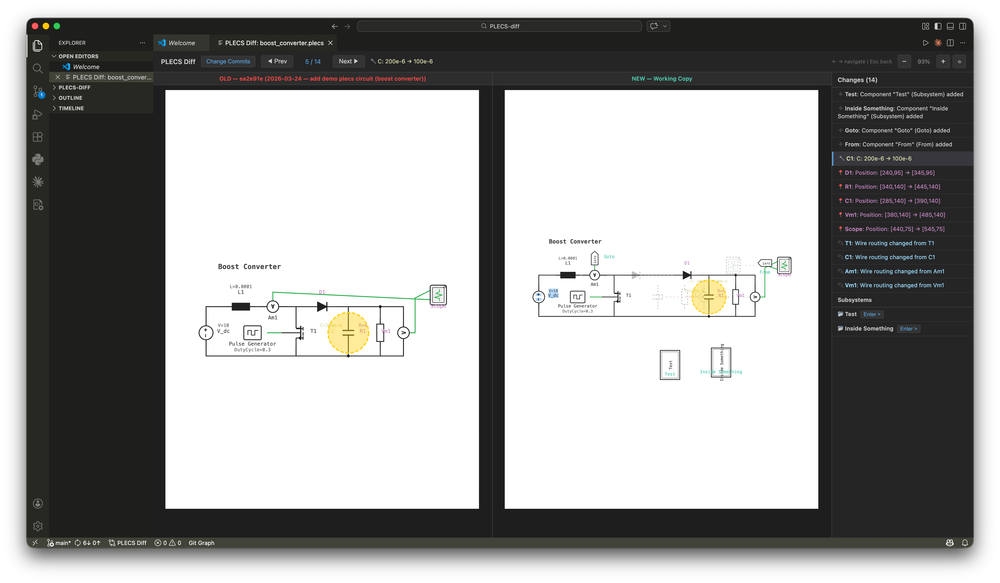

# PLECS Diff Viewer



Visual diff viewer for PLECS circuit files (`.plecs`) across Git commits inside VS Code.


## Features

- Compare a PLECS file between two commits, or between a commit and your working copy.
- Open from status bar command (`PLECS Diff`) or from file context menu.
- View circuit-level changes and navigate subsystem differences in the panel.

## Visual Indicators

The extension uses colors and line styles to indicate different types of changes:

- **🟢 Green Solid**: Newly added component.
- **🔴 Red Solid**: Removed component.
- **🟡 Yellow/Khaki Solid**: Parameter changed inside a component (e.g., resistance, voltage) without component addition/removal.
- **🟣 Purple Dashed**: Component position changed.
  - **Ghost Component (Faded dashed)**: Represents the previous location of the moved component.
  - **Position Change Line (Dashed)**: Shows the path between the old and new positions.
- **🔘 Highlight Ring (Large yellow dashed circle)**: Focuses on the currently selected change from the left diff list.

## Requirements

- VS Code `1.85.0` or newer
- A Git repository containing `.plecs` files
- PLECS files committed in Git history for commit-to-commit comparisons

## Install (Offline VSIX)

Use this method when internet access is restricted or Marketplace install is unavailable.
Pre-compiled binary can be downloaded in the `release` tab.

### 1. Install in VS Code UI using a pre-compiled bianary:
 1. Open Extensions view.
 2. Select the `...` menu.
 3. Choose `Install from VSIX...`.
 4. Select the VSIX file from `build_extension/`.

You can see the detailed step in this link: [https://developer.analog.com/docs/codefusion-studio/1.1.0/user-guide/installation/install-extensions/](https://developer.analog.com/docs/codefusion-studio/1.1.0/user-guide/installation/install-extensions/)

### 2. Install in VS Code using command line and a pre-compiled bianary:

```bash
code --install-extension build_extension/<generated-file>.vsix
```

Example:

```bash
code --install-extension build_extension/plecs-diff-viewer-0.2.0.vsix
```

### 3. Build the VSIX package:

**Mac/Linux:**
```bash
./build.sh
```

**Windows (PowerShell):**
```powershell
.\build.ps1
```

Optional: set a temporary package version for that build only:

**Mac/Linux:**
```bash
./build.sh --version 0.2.0
```

**Windows:**
```powershell
.\build.ps1 -version 0.2.0
```


## How To Use

### Option A: Open from Status Bar

1. Open a workspace that contains `.plecs` files in a Git repository.
2. Click `PLECS Diff` in the VS Code status bar.
3. Select the target `.plecs` file (if prompted).
4. In the panel, choose the `OLD` and `NEW` commits (or `Working Copy`).
5. Click compare to view the visual diff.

### Option B: Open from File Context

1. In Explorer, right-click a `.plecs` file.
2. Select `PLECS Diff: Compare File Between Commits`.
3. Select `OLD` and `NEW` versions in the panel.

## Build And Package

```bash
./build.sh
```

Build output:

- VSIX file is generated under `build_extension/`.
- The package includes this `README.md` file and uses it as the extension readme.

## Development

Install dependencies:

```bash
npm install
```

**Tip**: To test the extension directly in VS Code, simply press **`F5`**. This automatically runs the `npm: build` task and launches a new Extension Development Host window.

Build extension bundle (manual):

```bash
npm run build
```

Watch mode:

```bash
npm run watch
```

## Troubleshooting

- `Failed to get git log`: make sure the workspace root is a Git repository and the file is tracked.
- `Error loading diff`: verify the selected file exists in the selected commit and is a valid PLECS file.
- No `.plecs` files found: open the correct workspace folder and check file extension.
